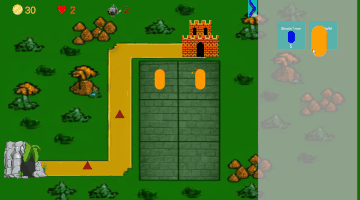
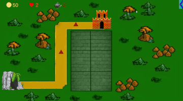

# Tower Defence Core

Tower Defense на Unity DOTS/ECS - реализация классического жанра через
Data-Oriented подход вместо привычного OOP. Акцент на архитектуре,
системах эффектов и двустороннем взаимодействии UI с ECS-миром.

---

## Демонстрация

---

## Ключевые механики

**Двусторонний мост MonoBehaviour <=> ECS**
UI-скрипты (`ShowCoins`, `ShowLevelHp`) читают данные напрямую из ECS через
`World.DefaultGameObjectInjectionWorld.EntityManager`. `DragShopElement` идёт
дальше - по окончании drag-and-drop он вызывает `_entityManager.Instantiate()`
для спауна башни и записывает обновлённый баланс монет обратно в ECS-компонент,
не создавая промежуточных событий.

**Полиморфная система эффектов через ScriptableObject**
Базовый класс `AbstractEffectConfig` хранит глобальный `Dictionary<int, Config>`
и объявляет абстрактный `AppendToBuffer(entity, ecb)`. Каждый эффект - отдельный
SO (`BurningEffectConfig`, `DamageEffectConfig`) - сам знает как добавить себя
в нужный `DynamicBuffer`. Это позволяет добавлять новые эффекты без изменения
кода систем.

**Стакание эффектов горения с приоритизацией**
`BurnResolverJob` при одновременном применении нескольких эффектов горения
выбирает тот, у которого наибольший таймер, вместо суммирования. Логика
намеренно упрощает баланс и исключает «стак-абьюз».

**Сетка размещения башен**
`GridTowerControl` хранит двумерный массив позиций и булевых флагов занятости.
`DragShopElement` валидирует позицию дропа в реальном времени, подсвечивая
ячейки зелёным/красным спрайтом.

---

## Технический стек

| | |
|---|---|
| **Движок** | Unity 2022.3.13f1 |
| **Язык** | C# |
| **Архитектура** | Unity DOTS - Entities 1.0.0-pre.3 |
| **Производительность** | Burst Compiler, IJobEntity |
| **Паттерны** | Abstract Factory (эффекты), Singleton Entity (Storage) |
| **Данные** | ScriptableObject, DynamicBuffer, IBufferElementData |
| **UI** | TextMeshPro, Unity UI Canvas |
| **VFX** | Unity VFX Graph (Fireball), ShaderGraph (FlameShader) |

---

## Что я узнал

Главный вызов - интеграция UI с ECS. В DOTS нет привычных ссылок на объекты:
UI живёт в MonoBehaviour-мире, а игровые данные - в Entity-мире. Решил это
через прямой доступ к `EntityManager` из MonoBehaviour: UI-компоненты в `Start()`
находят нужный singleton-Entity через `EntityQuery`, а в `Update()` читают
актуальные данные. Для записи (покупка башни) - напрямую вызываю
`SetComponentData` и `Instantiate` на Entity. Это работает, но создаёт
зависимость MonoBehaviour от конкретных ECS-типов - в следующей итерации
стоило бы вынести это в отдельный System.

Работа с Burst Compiler открыла ограничения managed-кода: нельзя использовать
обычные C#-словари внутри Burst-джобов. Именно поэтому `AbstractEffectConfig.Mapping`
используется только вне Burst-контекста - в не-помеченных `[BurstCompile]`
джобах.

Система эффектов - первый опыт проектирования расширяемой архитектуры:
абстрактный ScriptableObject-конфиг с методом `AppendToBuffer` позволяет
добавлять новые эффекты (яд, заморозка) без правки существующих систем.

---

## Как запустить

1. Клонировать репозиторий
2. Открыть в **Unity 2022.3.13f1**
3. Запустить сцену `LevelScene`

> ⚠️ Проект использует Unity DOTS в pre-release версии (`Entities 1.0.0-pre.3`).
> Используй точную версию Unity, чтобы избежать проблем совместимости.

---

*История коммитов до форка: [frogsrop/TowerDefenceCore](https://github.com/frogsrop/TowerDefenceCore)*
